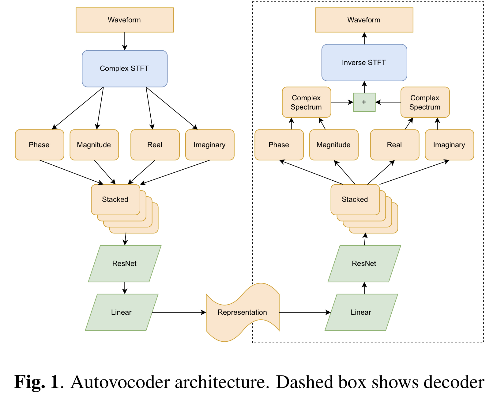

# Autovocoder: Fast Waveform Generation from a Learned Speech Representation using Differentiable Digital Signal Processing
Unofficial Pytorch implementation of [Autovocoder: Fast Waveform Generation from a Learned Speech Representation using Differentiable Digital Signal Processing](https://arxiv.org/abs/2211.06989).
This repository is based on **[iSTFTNet github](https://github.com/rishikksh20/iSTFTNet-pytorch) [(Paper)](https://arxiv.org/abs/2203.02395)**.<br>



`Disclaimer : This repo is build for testing purpose. Welcome your contributions.`
## Training :
```
python train.py --config config.json
```
In `config.json`, change `latent_dim` for `AV128`, `AV192`, and `AV256` (Default).<br>
Considering `Section 3.3`, you can select `dec_istft_input` between `cartesian` (Default), `polar`, and `both`.

## Note:

## Citations :
```
@article{Webber2022AutovocoderFW,
  title={Autovocoder: Fast Waveform Generation from a Learned Speech Representation using Differentiable Digital Signal Processing},
  author={Jacob J. Webber and Cassia Valentini-Botinhao and Evelyn Williams and Gustav Eje Henter and Simon King},
  journal={ArXiv},
  year={2022},
  volume={abs/2211.06989}
}
```

## References:
* https://github.com/jik876/hifi-gan
* https://github.com/rishikksh20/iSTFTNet-pytorch
